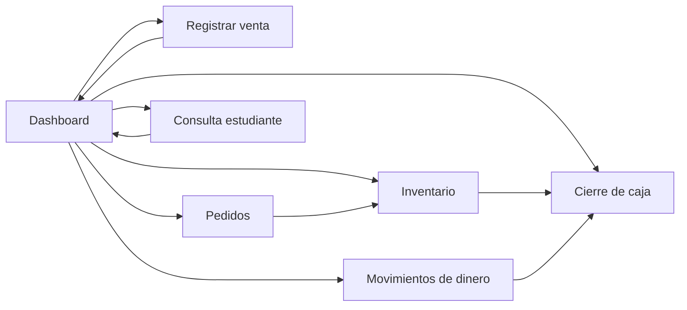
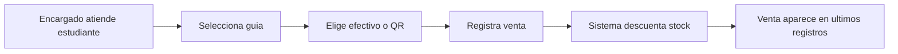
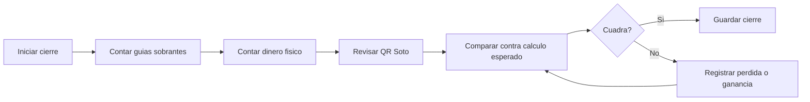
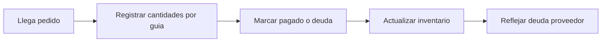

# Semana 3 - Arquitectura de informacion y diseno de interfaz

## Objetivo del prototipo

Disenar un prototipo inicial de baja fidelidad para apoyar el control presencial de guias academicas de Fisica. El sistema no reemplaza la venta presencial. Organiza ventas, inventario, movimientos de dinero, pedidos y cierre de caja.

## Usuarios

- Encargados del Centro de Estudiantes: usuario principal. Registran ventas, stock, pagos, salidas, pedidos y cierre.
- Departamento de Fisica: usuario interesado en control y rendicion.
- Estudiantes compradores: usuario indirecto. Consulta disponibilidad, precio y guia correcta.

## Estructura del contenido

- Dashboard
  - Venta rapida por guia y tipo de pago.
  - Stock actual.
  - Ultimos registros.
  - Ventas de semana actual y anterior.
  - Resumen de dinero: fisico, QR, total, gastos y deuda.
  - Registro rapido de salida de dinero.
  - Registro rapido de llegada de guias.
- Registrar venta
  - Guia.
  - Cantidad.
  - Metodo de pago: efectivo o QR.
  - Confirmacion.
- Inventario
  - Fiadas.
  - Compradas.
  - Vendidas en efectivo.
  - Vendidas por QR.
  - Stock restante.
  - Estado.
- Movimientos de dinero
  - Caja fisica.
  - Soto QR.
  - Gasto, pago, perdida, ganancia o retiro.
  - Motivo y encargado.
- Cierre de caja
  - Ultimo cierre.
  - Conteo fisico de guias.
  - Dinero fisico contado.
  - Ganancias.
  - Gastos.
  - Diferencia.
  - Guardado de verificacion.
- Pedidos
  - Llegadas de guias.
  - Precio de compra.
  - Pagado o pendiente.
  - Comentarios.
- Consulta estudiante
  - Guia.
  - Materia.
  - Stock.
  - Precio.
  - Lugar y metodos de pago.

## Mapa del sistema

## Flujos de navegacion

### Flujo 1: registrar venta presencial

### Flujo 2: cierre de caja

### Flujo 3: llegada de guias

## Wireframes de baja fidelidad

Los wireframes se implementaron como prototipo HTML simple:

[Abrir prototipo baja fidelidad](../prototype-lowfi/index.html)

Pantallas incluidas:

- Dashboard.
- Registrar venta.
- Inventario.
- Movimientos de dinero.
- Cierre de caja.
- Pedidos.
- Consulta estudiante.

## Sistema visual

El cliente pidio un estilo parecido a Microsoft Student / Encarta, con tonos maduros y frios. Por eso se usa una base celeste-azulada y etiquetas 100% azuladas/lilas.

Badges por dificultad:

- Fisica General: azul muy claro, guia mas facil.
- Fisica I: azul claro medio.
- Fisica II: azul mas intenso.
- Fisica III: violeta azulado oscuro, guia mas compleja.

La diferenciacion por color se mantiene secundaria. La informacion principal aparece por texto, tablas y agrupacion visual.

## Justificacion IHC

### Usabilidad

- Se priorizan acciones frecuentes en el dashboard.
- Registrar venta requiere pocos pasos.
- El cierre muestra pasos visibles para evitar errores.
- Las tablas mantienen nombres del Excel original para facilitar aprendizaje.

### Leyes de la Gestalt

- Proximidad: datos relacionados se agrupan en paneles.
- Similitud: botones, tablas y badges mantienen forma consistente.
- Continuidad: flujos van de izquierda a derecha y de arriba hacia abajo.
- Figura-fondo: paneles blancos sobre fondo celeste claro separan contenido.

### Carga cognitiva

- El dashboard reduce cambio de pantallas.
- El cierre divide una tarea compleja en pasos.
- Los calculos se muestran como resumen, no como formulas.
- Los colores identifican guias sin depender solo del color.

## Traduccion a Figma

Se puede importar el prototipo de dos formas:

1. Abrir `prototype-lowfi/index.html` en navegador y usar capturas por pantalla como base visual en Figma.
2. Recrear frames con esta navegacion:
   - Dashboard -> Registrar venta.
   - Dashboard -> Inventario.
   - Dashboard -> Movimientos.
   - Dashboard -> Cierre de caja.
   - Dashboard -> Pedidos.
   - Dashboard -> Consulta estudiante.
   - Cierre de caja -> Movimientos si no cuadra.
   - Pedidos -> Inventario.

Para Figma interactivo real, crear frames con esos nombres y conectar botones del menu lateral al frame correspondiente.
